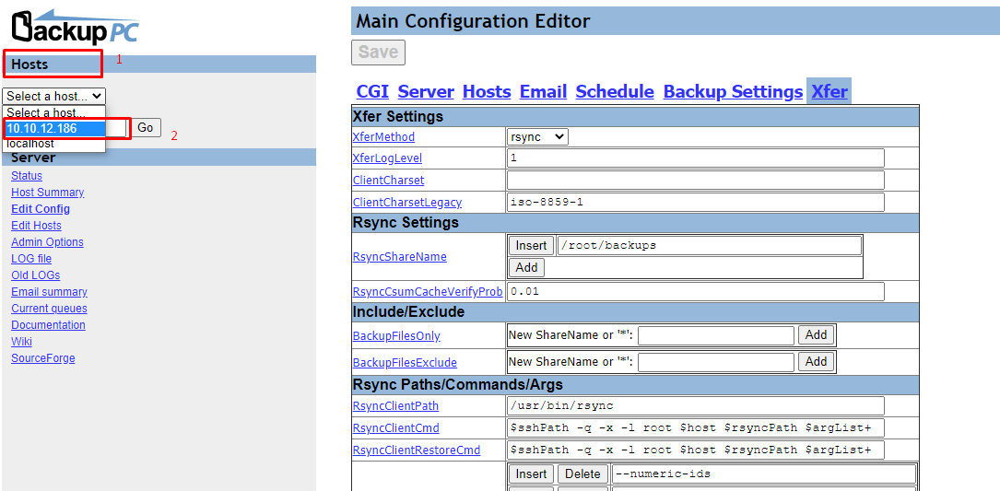

# Cấu hình backup PC backup dữ liệu trên linux

## 1. Cấu hình trên máy cài backuppc

- Chuyển sang user `backuppc`:

```sh
sudo su - backuppc
```

- Tạo mới key ssh

```sh
ssh-keygen
```

- Chuyển key sang máy cần backup

```sh
ssh-copy-id root@10.10.12.186
```

- Thử ssh sang máy client `10.10.12.186` xem đã thực hiện ssh bằng key thành công hay chưa

```sh
ssh root@10.10.12.186
```

- Kết quả


- Truy cập vào giao diện web

```sh
http://10.10.10.187/backuppc
```


- Tại sidebar của giao diện chọn `Edit Hosts`


- Chọn `add` để thêm host mới


- Điền thông tin host và user sau đó chọn `SAVE` để lưu lại


- Sau đó chọn sang tab `Xfer`


- Chuyển XferMethod sang `rsync` và cấu hình thư mục cần backup trên client và chọn `SAVE` để lưu lại cấu hình, ví dụ như hình bên dưới tối cần backup lại thư mục `/root/backups` trên client:


- Tại section `Host` chọn host vừa thêm



- Chọn `Start Full Backup` để tiến hành thực hiện lần backup full đầu tiên của thư mục đã cấu hình


- Quay lại đường dẫn giao diện của host chúng ta sẽ thấy được bản backup full đầu tiên sau khi quá trình backup thành công


- Chọn vào bản backup `#0` xem đã được backup đầy đủ dữ liệu trong thư mục cấu hình chưa


- Ở đây là kết quả được backup

