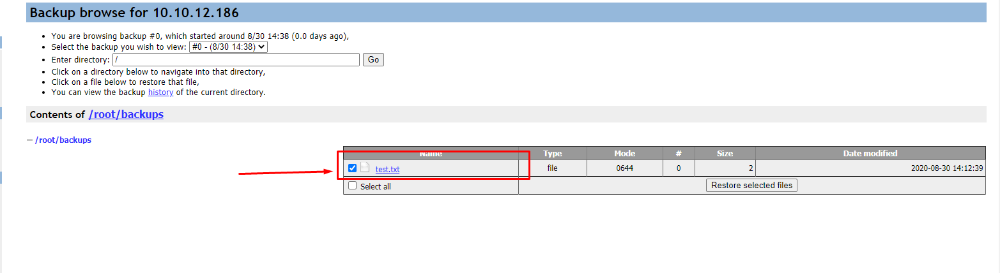

# Restore file từ backup của backuppc

- Kiểm tra các file đã được backup trên GUI backuppc


- Trên client thực hiện xóa file đã được backup trên server backuppc

```sh
cd /root/backups
rm -f test.txt
```


- Trở lại giao diện GUI của backuppc chọn file cần restore



- Sau đó chọn `Restore selected files`


- Chọn `Start restore` 


- Xác nhận để bắt đầu quá trình restore


- Sau khi quá trình restore hoàn tất, kiểm tra xem trên client data đã đúng như trên backuppc hay chưa


